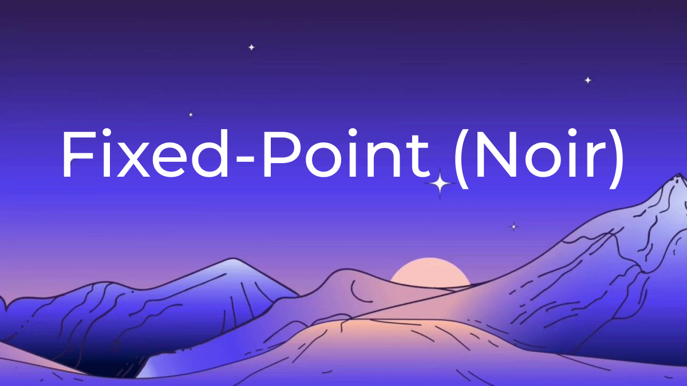

# noir-fixed-point
## Fixed point library for Aztec's noir language

The FixedPoint library offers precise fixed-point arithmetic operations tailored for Noir's unique environment, where every value is fundamentally composed of Field elements. This library is crucial for cryptographic contexts and applications that require exact decimal calculations, such as DeFi applications.

### Features

Robust Fixed-Point Arithmetic: Perform addition, subtraction, multiplication, division, and comparison with fixed-point numbers.
Flexible Scaling: Easily manage the scale (number of decimal places) for precise calculations.
Optimized for Noir: Specifically designed for Noir, ensuring compatibility and efficiency within its ecosystem.

### Installation

To use the FixedPoint library in your Noir project, include it as a dependency in your Noir project file.
Usage

The FixedPoint struct represents a fixed-point number with a value and a scale (number of decimal places). Here's how to use it:
Creating a FixedPoint Number

```

let fixed_num = FixedPoint::new(value, scale);

```
### Arithmetic Operations

Addition

    
```
let result = FixedPoint::add(fixed1, fixed2);
```

Subtraction


```
let result = FixedPoint::subtract(fixed1, fixed2);
```
Multiplication


```
let result = FixedPoint::multiply(fixed1, fixed2);
```
Division


```
let result = FixedPoint::divide(fixed1, fixed2);
```
### Comparison


```
let is_greater = FixedPoint::is_greater_than(fixed1, fixed2);
let is_lesser = FixedPoint::is_lesser_than(fixed1, fixed2);
```
### Advanced Operations

Power

    
```
let result = FixedPoint::power(base, exponent);
```
### Testing

Comprehensive tests are included to ensure the reliability and accuracy of arithmetic operations. Run these tests to verify the functionality in your environment.


```
#[test]
fn test_positive_integer_power() {
    let base = FixedPoint::new(2, 2); 
    let exponent = 3;
    let result = FixedPoint::power(base, exponent);
    assert(result.value == 8);
    assert(result.scale == 2);
}
```

### Contribution

Contributions are welcome! If you have suggestions for improvements or encounter any issues, please feel free to submit a pull request or raise an issue.
License

This library is distributed under the Apache License 2.0. See the LICENSE file for more details.
